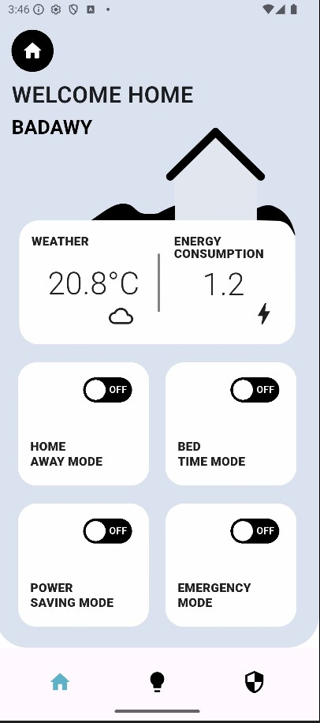
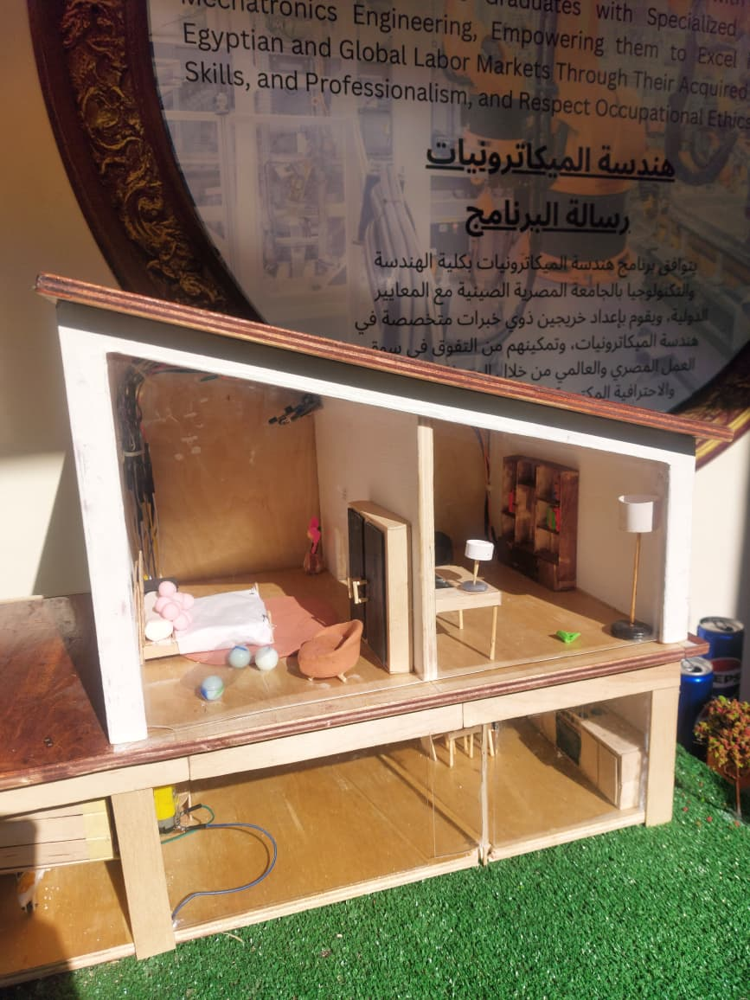

<div align="center">

# 🚀 Projecto-Messio

### *Distributed IoT System: ESP32 Hardware Control + C++ Backend + Flutter Mobile*

[](https://www.espressif.com/)
[](https://isocpp.org/)
[](https://flutter.dev/)
[](https://dart.dev/)
[](https://platformio.org/)

**Multi-layered IoT architecture integrating embedded systems, backend infrastructure, and mobile applications**

[Features](#-features) • [Architecture](#-architecture) • [Tech Stack](#-tech-stack) • [Team](#-team)

---

</div>

## 📖 Overview

<div align="center">

**Projecto-Messio** is a distributed IoT system developed for **Programming 1** and **Digital Design** university courses. The project demonstrates real-world integration of hardware control, server-side processing, and mobile interfaces through a multi-component architecture.

ESP32 microcontrollers manage physical hardware (servo motors, LEDs, buzzers, sensors), a C++ backend handles data processing and business logic, while a Flutter mobile application with Dart backend layer provides real-time monitoring and control capabilities.

</div>

---

## ✨ Features

<div align="center">

<table>
<tr>
<td width="50%" align="center">

### 🔌 Hardware Layer
- Dual ESP32 microcontrollers
- Servo motors, LEDs, buzzers
- Sensor data collection
- PlatformIO firmware

</td>
<td width="50%" align="center">

### ⚙️ Backend Services
- Standalone C++ server
- RESTful API endpoints
- Real-time data processing
- Device management

</td>
</tr>
<tr>
<td width="50%" align="center">

### 📱 Mobile Application
- Flutter frontend
- Dart backend layer
- Cross-platform (iOS/Android)
- Device control dashboard

</td>
<td width="50%" align="center">

### 🔐 System Integration
- REST API communication
- Multi-device synchronization
- Real-time status updates
- Remote hardware control

</td>
</tr>
</table>

</div>

---

## 🏗️ Architecture

<div align="center">

```
┌─────────────────────────────────────────────────────────────────┐
│                  PROJECTO-MESSIO SYSTEM ARCHITECTURE             │
└─────────────────────────────────────────────────────────────────┘

        HARDWARE LAYER (Physical Location A)
┌──────────────────────────────────────────────────────────────────┐
│                                                                   │
│  ┌─────────────────┐              ┌─────────────────┐           │
│  │    ESP32 #1     │              │    ESP32 #2     │           │
│  │  (Controller)   │              │  (Controller)   │           │
│  └────────┬────────┘              └────────┬────────┘           │
│           │                                │                     │
│           ├─ 🔴 LEDs                       ├─ 🔴 LEDs           │
│           ├─ 🔊 Buzzer                     ├─ 🔊 Buzzer         │
│           ├─ ⚙️  Servo Motors              ├─ ⚙️  Servo Motors  │
│           └─ 📡 Sensors                    └─ 📡 Sensors        │
│                                                                   │
└──────────────────────────────────────────────────────────────────┘
                            │
                            │ REST API / HTTP Requests
                            │
                            ▼
        BACKEND LAYER (Physical Location B)
┌──────────────────────────────────────────────────────────────────┐
│                                                                   │
│                   ┌──────────────────────┐                       │
│                   │   C++ Backend Server │                       │
│                   ├──────────────────────┤                       │
│                   │ • Business Logic     │                       │
│                   │ • Data Processing    │                       │
│                   │ • API Endpoints      │                       │
│                   │ • Device Management  │                       │
│                   └──────────┬───────────┘                       │
│                              │                                    │
└───────────────────────────────────────────────────────────────────┘
                               │
                               │ REST API / HTTP Requests
                               │
                               ▼
        MOBILE LAYER (Physical Location C)
┌──────────────────────────────────────────────────────────────────┐
│                                                                   │
│            ┌──────────────────────────────┐                      │
│            │   Dart Backend Layer         │                      │
│            ├──────────────────────────────┤                      │
│            │ • Mobile Business Logic      │                      │
│            │ • API Integration            │                      │
│            │ • Data Transformation        │                      │
│            └──────────┬───────────────────┘                      │
│                       │                                           │
│                       ▼                                           │
│            ┌──────────────────────────────┐                      │
│            │  Flutter Mobile App          │                      │
│            ├──────────────────────────────┤                      │
│            │ • User Interface             │                      │
│            │ • Control Dashboard          │                      │
│            │ • Real-time Monitoring       │                      │
│            │ • Device Controls            │                      │
│            └──────────────────────────────┘                      │
│                                                                   │
└──────────────────────────────────────────────────────────────────┘
```

</div>

<div align="center">

### 🔄 Data Flow

**ESP32 Devices** → Control hardware (LEDs, servos, buzzers) and collect sensor data  
**C++ Backend** → Process requests and manage business logic  
**Dart Backend** → Handle mobile app logic and data transformation  
**Flutter App** → Display interface for monitoring and control

</div>

---

## 🛠️ Tech Stack

<div align="center">

### Embedded Systems
```
ESP32 Microcontrollers (×2)  →  PlatformIO  →  C/C++ Firmware
```

### Backend Infrastructure
```
C++ Core Server  →  RESTful APIs  →  Dart Backend Layer
```

### Mobile Development
```
Flutter Framework  →  Dart Language  →  Cross-Platform Apps
```

### Development Tools

| Category | Technology |
|----------|-----------|
| **Embedded IDE** | CLion, PlatformIO |
| **Mobile IDE** | Android Studio |
| **Version Control** | Git, GitHub |

</div>

---

## 📁 Project Structure

```
Projecto-Messio/
│
├── 💡 .idea/                      # CLion IDE configuration
│
├── 🖥️  C++ Backend/                # Core backend server
│   ├── ESP1/                      # ESP32 Unit 1 firmware
│   ├── ESP2/                      # ESP32 Unit 2 firmware
│   └── backend server/            # C++ server implementation
│
├── 📱 MobileApp/                   # Flutter mobile application
│   ├── lib/                       # Dart source code
│   ├── android/                   # Android platform files
│   ├── ios/                       # iOS platform files
│   └── pubspec.yaml
│
├── 📚 docs/                        # Documentation & media
│   ├── images/
│   │   ├── home.jpg
│   │   └── app.jpg
│   └── videos/
│       └── demo.mp4
│
└── 📄 README.md
```

---

## 📸 Project Gallery

<div align="center">

### Mobile Application Interface



*Flutter mobile app showing device control dashboard*

---

### Physical Hardware Setup



*ESP32 microcontrollers with connected hardware components*

---

### Demo Video

[▶️ Watch Full Application Demo](docs/videos/demo.mp4)

</div>

---

## 👥 Team

<div align="center">

<table>
<tr>
<td align="center">
<a href="https://github.com/M7MEDpro">

<br />
<sub><b>Mohamed Badawy</b></sub>
</a>
</td>
<td align="center">
<a href="https://github.com/khaledkaram688">

<br />
<sub><b>Khaled Karam</b></sub>
</a>
</td>
<td align="center">

<br />
<sub><b>Omar Mustafa</b></sub>
</td>
</tr>
<tr>
<td align="center">
<a href="https://github.com/Mariam-Rashed">

<br />
<sub><b>Mariam Mohamed</b></sub>
</a>
</td>
<td align="center">

<br />
<sub><b>Abdelrahman Waleed</b></sub>
</td>
<td></td>
</tr>
</table>

</div>

---

## 🎓 Academic Context

<div align="center">

**Integrated Two-Course University Project**

This project was developed to fulfill requirements for two complementary university courses, demonstrating the practical application of theoretical concepts across hardware and software domains.

| Course | Focus |
|--------|-------|
| **Programming 1** | Software development fundamentals, algorithms, and C++ programming |
| **Digital Design** | Digital logic circuits, Boolean algebra, sequential/combinational logic, and hardware design principles |

</div>

---

## 🤝 Contributing

<div align="center">

Suggestions and feedback are welcome!

Fork the repository → Create your feature branch → Submit a pull request

</div>

---

## 📝 License

<div align="center">

Educational project developed for university coursework.

</div>

---

## 📬 Contact

<div align="center">

Questions or collaboration? Reach out via GitHub Issues or connect with team members through their profiles.

---

**Built by university students**

[⬆️ Back to Top](#-projecto-messio)

</div>